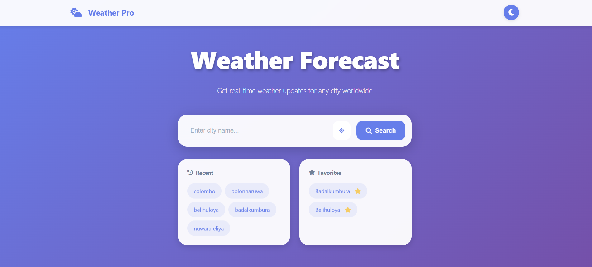
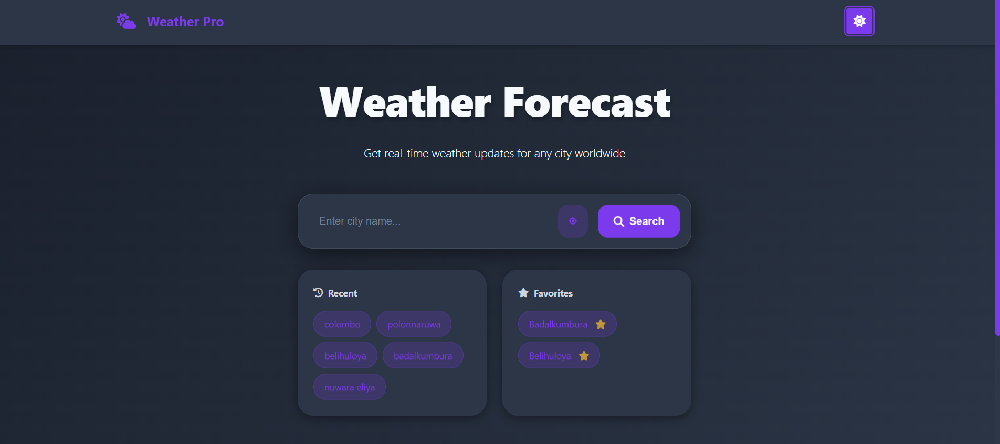
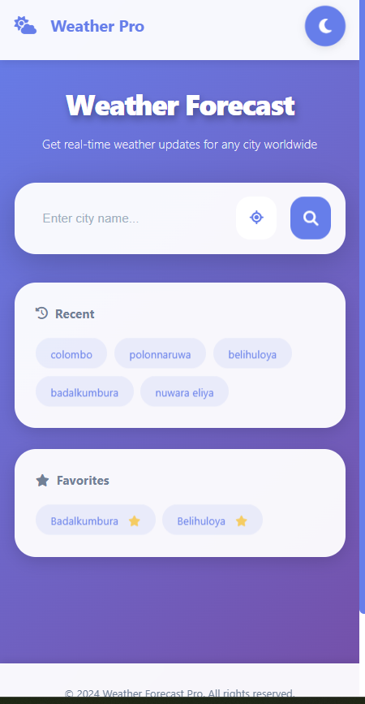

# 🌤️ Weather Forecast Pro

A modern, professional weather forecast application with real-time data, interactive charts, and beautiful UI/UX design.

## ✨ Features

### Core Features
- 🔍 **Smart City Search** - Search any city worldwide with autocomplete
- 📍 **GPS Location** - Auto-detect your current location
- 🌡️ **Real-time Weather** - Current temperature, conditions, and more
- 📊 **5-Day Forecast** - Extended weather predictions
- 📈 **Weather Charts** - Visual temperature and humidity trends

### Advanced Features
- 🌓 **Light/Dark Mode** - Seamless theme switching
- 🎨 **Dynamic Backgrounds** - Changes based on weather conditions
- 💾 **Offline Support** - Works without internet (cached data)
- ⭐ **Favorite Locations** - Save up to 5 favorite cities
- 📜 **Search History** - Quick access to recent searches
- 🌅 **Sunrise/Sunset** - Detailed solar information
- 💨 **Wind & Humidity** - Comprehensive weather metrics
- ☀️ **UV Index** - Sun exposure information
- 🌫️ **Air Quality** - Pollution levels (AQI)

### Technical Features
- 📱 **Fully Responsive** - Perfect on mobile, tablet, and desktop
- ⚡ **Performance Optimized** - Fast loading with caching
- ♿ **Accessible** - WCAG 2.1 compliant
- 🔒 **Secure** - API keys properly managed
- 🎯 **PWA Ready** - Install as a native app

## 🚀 Quick Start

### Prerequisites
- A modern web browser (Chrome, Firefox, Safari, Edge)
- OpenWeatherMap API key (free tier available)

### Installation

1. **Clone the repository**
```bash
git https://github.com/Pathum-Piyumal/weather-app.git
cd weather-forecast-pro
```

2. **Configure API Key**
   - Open `config/config.js`
   - Replace `YOUR_API_KEY` with your OpenWeatherMap API key
   - Get your free API key at: https://openweathermap.org/api

3. **Run the application**
   - Simply open `index.html` in your browser
   - Or use a local server:
   ```bash
   # Using Python
   python -m http.server 8000
   
   # Using Node.js
   npx serve
   ```

4. **Access the app**
   - Navigate to `http://localhost:8000`

## 📸 Screenshots

### Light Mode


### Dark Mode


### Mobile View


## 🛠️ Tech Stack

- **Frontend**: HTML5, CSS3, Vanilla JavaScript (ES6+)
- **Charts**: Chart.js
- **Icons**: OpenWeatherMap Icons + Custom SVGs
- **API**: OpenWeatherMap API
- **Storage**: LocalStorage for caching and preferences
- **PWA**: Service Workers for offline support

## 📁 Project Structure

```
weather-forecast-app/
├── index.html              # Main HTML file
├── README.md               # Documentation
├── .gitignore             # Git ignore rules
├── manifest.json          # PWA manifest
├── service-worker.js      # Service worker for offline
├── assets/
│   ├── images/            # Images and icons
│   └── fonts/             # Custom fonts
├── css/
│   ├── main.css          # Main styles
│   ├── themes.css        # Light/Dark themes
│   ├── responsive.css    # Media queries
│   └── animations.css    # Animations
├── js/
│   ├── app.js            # Main application
│   ├── api.js            # API handling
│   ├── ui.js             # UI updates
│   ├── utils.js          # Helper functions
│   ├── storage.js        # LocalStorage management
│   ├── geolocation.js    # GPS functionality
│   └── charts.js         # Chart rendering
├── config/
│   └── config.js         # Configuration & API keys
└── docs/
    └── screenshots/      # Documentation images
```


## 🤝 Contributing

Contributions are welcome! Please follow these steps:

1. Fork the repository
2. Create a feature branch (`git checkout -b feature/AmazingFeature`)
3. Commit your changes (`git commit -m 'Add some AmazingFeature'`)
4. Push to the branch (`git push origin feature/AmazingFeature`)
5. Open a Pull Request

## 📝 License

This project is licensed under the MIT License - see the [LICENSE](LICENSE) file for details.

## 👨‍💻 Author

- GitHub: https://github.com/Pathum-Piyumal
- LinkedIn: https://www.linkedin.com/in/pathum-piyumal-kumarathunga-48185b32b/
- Email: pathumpiyumal013@gmail.com

## 🙏 Acknowledgments

- OpenWeatherMap for the weather API
- Chart.js for beautiful charts
- Icons from OpenWeatherMap and custom designs
- Inspiration from modern weather apps

## 📊 Performance

- Lighthouse Score: 95+
- Load Time: < 2s
- First Contentful Paint: < 1s
- Time to Interactive: < 2.5s


## 📧 Support

If you have any questions or need help, please open an issue or contact me directly.


⭐ **Star this repository if you found it helpful!**

Made with ❤️ by a passionate developer